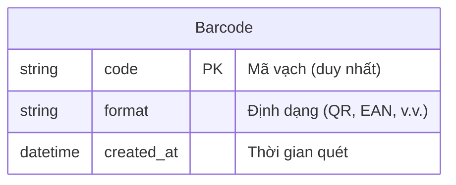

# Thiết Kế Data Model - Barcode Scanner Web App (Phase 1)

## 1. Danh sách entity
| Entity | Mô tả |
|--------|-------|
| `Barcode` | Lưu trữ thông tin mã vạch đã quét |

## 2. Thuộc tính chính
| Entity | Thuộc tính | Kiểu dữ liệu | Mô tả | Ràng buộc |
|--------|------------|--------------|-------|-----------|
| Barcode | code | string | Giá trị mã vạch (ID) | **PK**, unique |
| Barcode | format | string | Định dạng mã vạch (QR, EAN13, v.v.) | optional |
| Barcode | created_at | datetime | Thời gian quét | auto-generated |

## 3. Quan hệ dữ liệu
- **Không có quan hệ** giữa các entity do Phase 1 chỉ cần lưu trữ đơn lẻ mã vạch
- **Unique constraint**: `code` đảm bảo không lưu trùng mã vạch
- **Sorting**: `created_at` hỗ trợ hiển thị danh sách theo thứ tự mới nhất

---

### Ghi chú thiết kế
- **Độ dài code**: Tùy theo chuẩn mã vạch (QR có thể đến 4.000 ký tự)
- **Định dạng mã vạch**: Có thể mở rộng thành enum nếu cần kiểm soát chuẩn (QR_CODE, EAN13, UPC_A, v.v.)
- **Tối ưu truy vấn**: Thêm index cho `created_at` để tăng tốc load danh sách
