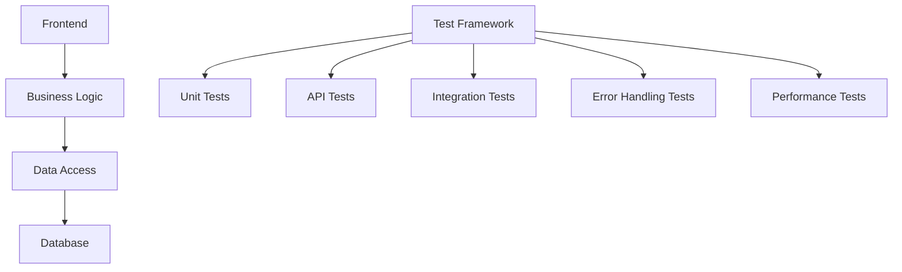

# 1. Tổng quan kiến trúc

Kiến trúc hệ thống tập trung vào 4 nguyên tắc cốt lõi:
- **Modularization**: Tách biệt rõ ràng giữa UI, business logic và data access
- **Testability**: Thiết kế các layer có thể mock được để dễ kiểm thử
- **Separation of Concerns**: Phân tách logic xử lý barcode, validation, storage thành các module độc lập
- **Error Resilience**: Xử lý lỗi ở từng layer với fallback mechanism

Hệ thống được thiết kế để dễ dàng kiểm thử từng thành phần riêng lẻ thông qua các interface rõ ràng giữa các layer.

# 2. High-level Architecture

mermaid
graph TD
    subgraph Frontend
        UI[React Components] -->|useBarcodeScanner| BL[Business Logic]
        UI -->|useBarcodeStore| BL
    end
    
    subgraph Business Logic
        BL -->|call| S1[Barcode Parser]
        BL -->|call| S2[Validation Service]
        BL -->|call| S3[Storage Service]
    end
    
    subgraph Data Access
        S3 -->|CRUD| DB[SQLite Database]
    end
    
    subgraph Testing
        T1[Jest] -->|Mock| BL
        T1 -->|Mock| S3
        T2[React Testing Library] -->|Render| UI
        T3[Supertest] -->|Call| API
    end

# 3. Component Description

## 3.1 Frontend Layer
- **React Components**: 
  - BarcodeScanner (chính)
  - BarcodeList
  - ScanResult
  - ErrorMessage
- **React Hooks**:
  - useBarcodeScanner (xử lý camera và decode)
  - useBarcodeStore (state management)
  - useErrorBoundary (xử lý lỗi UI)

## 3.2 Business Logic Layer
- **Barcode Parser**: 
  - Xử lý decode từ camera mock
  - Xử lý lỗi decode
- **Validation Service**:
  - Kiểm tra định dạng barcode
  - Kiểm tra trùng lặp
- **Storage Service**:
  - Giao tiếp với database
  - Xử lý batch insert

## 3.3 Data Access Layer
- **SQLite Database**:
  - Schema đơn giản (id, value, created_at)
  - Index trên cột value để tìm trùng lặp
- **Database Helper**:
  - Connection pooling
  - Transaction management

## 3.4 Testing Layer
- **Unit Tests**:
  - Parser logic
  - Validation rules
  - Storage operations
- **API Tests**:
  - POST /api/barcodes
  - GET /api/barcodes
- **Integration Tests**:
  - Flow scan → save → list
  - Error handling scenarios
- **Performance Tests**:
  - Batch insert 1000 records
  - Render 5000 records

## 3.5 Logging & Debug Module
- **Structured Logging**:
  - JSON format
  - Level: debug/info/warn/error
- **Error Tracking**:
  - Lỗi decode
  - Lỗi database
  - Lỗi API
- **Debug Flag**:
  - Bật/tắt logging chi tiết
  - Bật/tắt mock data

# 4. Deployment View

mermaid
graph TD
    subgraph Development
        D1[VSCode] --> D2[Local SQLite]
        D1 --> D3[Test Framework]
    end
    
    subgraph Test
        T1[Test Container] --> T2[Test DB]
        T1 --> T3[Test API]
    end
    
    subgraph Staging
        S1[Node.js] --> S2[SQLite]
        S1 --> S3[Test Coverage Report]
    end
    
    subgraph CI/CD
        C1[GitHub Actions] --> C2[Test Pipeline]
        C2 --> C3[Test Results]
    end

**Testing Pipeline**:
1. Linting (ESLint + Prettier)
2. Unit Tests (Jest/Vitest)
3. API Tests (supertest)
4. Integration Tests (React Testing Library)
5. Coverage Report (Istanbul)
6. Static Analysis (SonarQube)

**Test Environment Configuration**:
- Database: SQLite in-memory instance
- Camera: Mock scan results
- API: Mock server for error scenarios
- Logging: Debug mode bật

**Key Metrics**:
- Test Coverage ≥ 70%
- API Latency < 200ms
- Batch Insert 1000 records < 500ms
- 5000 Records Render < 1s

Kiến trúc này đảm bảo hệ thống có thể được kiểm thử toàn diện mà không cần thay đổi cơ sở hạ tầng hiện tại, đồng thời duy trì tính ổn định và dễ bảo trì cho giai đoạn phát triển tiếp theo.
